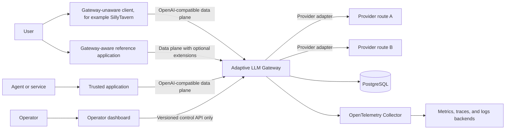

# Architecture

Status: Accepted for M0 under [issue #3](https://github.com/NatsumeRyuhane/LLM-Gateway/issues/3)

## System context



The gateway is a modular monolith: data plane, control plane, routing, health,
accounting, and storage run in one deployable Go process, while their package
boundaries remain explicit. The mock provider is a second binary built from the
same Go module for testing and demonstrations.

## Data plane

The data plane is latency- and cancellation-sensitive. A request follows this
ordered path:

1. Authenticate the application credential and resolve subject/run context.
2. Parse the requested route or model group and validate required capabilities.
3. Load a bounded policy/evidence snapshot and filter candidates.
4. Apply affinity, deterministic ranking, and tie-breaking.
5. Persist or enqueue the decision record before the upstream attempt.
6. Translate the canonical request through one provider adapter.
7. Stream events with backpressure and cancellation propagation.
8. Before visible output only, classify eligible failures and consume a bounded
   retry/fallback budget.
9. Finalize attempt, usage, cost, latency, and decision evidence.

The streaming path must not synchronously depend on the dashboard or an
observability backend. Telemetry export failure cannot corrupt response bytes.

## Control plane

The versioned control API owns provider routes, application registrations,
credentials, model groups, policies, probes, health evidence, usage queries,
and audited administrative actions. The React dashboard consumes only this API;
it never reads PostgreSQL or telemetry backends directly.

Control-plane unavailability may prevent configuration changes and rich queries,
but should not automatically interrupt an already configured data plane. The
exact cached-read behavior is deferred until measured availability requirements
justify it.

## Frontend surfaces

The `frontend/` workspace contains two applications with separate permissions:

- `frontend/apps/reference` is a gateway-aware reference integration. It uses
  the data plane and its optional extensions to demonstrate conversation/run
  identity, model groups, routing outcomes, cancellation, usage, and latency.
- `frontend/apps/dashboard` is the operator interface. It uses only the control
  API and cannot become a shortcut around control-plane authorization or audit.

The applications may share presentation components and generated API types, but
they do not share credentials or authorization assumptions. Browser assets must
not embed long-lived application or provider credentials; the reference
application's backend-for-frontend or short-lived credential mechanism is
defined by the security contract.

## Backend package boundaries

The planned package dependency direction is inward toward domain types:

```text
cmd/gateway
    -> internal/app
        -> auth, controlapi, telemetry
        -> routing -> health
        -> provider adapters -> protocol
        -> accounting
        -> storage implementations

domain packages -> small consumer-owned interfaces
infrastructure packages -> domain interfaces and models
```

| Package | Owns | Must not own |
| --- | --- | --- |
| `protocol` | Canonical requests, responses, events, capabilities, and errors | Provider-specific HTTP clients |
| `openai` | Public v0 HTTP/JSON/SSE decoding, encoding, and compatibility errors | Authentication, routing, provider translation, or credential material |
| `provider` | Adapter contract and provider implementations | Routing policy |
| `routing` | Candidate filtering, affinity, deterministic selection, retry budget | Raw provider wire formats |
| `health` | Evidence, freshness, confidence, state transitions | Traffic selection side effects |
| `auth` | Application/credential/principal context and authorization | Human application login |
| `accounting` | Usage, cost, quota, and run/request attribution | Telemetry backend storage |
| `telemetry` | Signal schemas, exporters, correlation, redaction | Business decisions inferred from metrics |
| `storage` | PostgreSQL repositories and transaction boundaries | Domain policy |
| `controlapi` | Versioned administrative HTTP contract | Direct dashboard coupling |
| `app` | Construction, lifecycle, graceful shutdown, request/attempt orchestration | Routing policy or provider wire behavior |

Interfaces are defined by the consuming package and kept narrow. Shared utility
packages are avoided unless at least two stable consumers need the same concept.

The initial scaffold materializes every boundary above in the single
`backend/` module. `app`, `config`, `health`, `openai`, and `protocol` contain
runtime behavior; the remaining packages start as documented boundaries until
their vertical-slice behavior lands. `cmd/gateway` and `cmd/mock-provider` both use
the shared lifecycle, but production packages do not import the mock-provider
command. Issue #7 still owns deterministic response profiles, fault injection,
and the guarded test-only control surface.

| Scaffold package | Initial responsibility |
| --- | --- |
| `config` | Load bounded HTTP settings, validate before bind, and return errors that identify keys without echoing values |
| `health` | Keep liveness independent from atomic process readiness; route-health evidence remains a later addition |
| `app` | Own the listener, standard-library HTTP server, serving goroutine, readiness transitions, and bounded shutdown |
| `protocol` | Own immutable validated Chat Completions requests, derived capabilities, buffered responses, usage, failures, and stream lifecycle validation |

### Authenticated single-route vertical slice

The first working data path lives in `internal/app`. It authenticates before
decoding target-bearing request content, exposes only the one model authorized
for the authenticated application, and resolves exactly one injected validated
provider route. The route source contains no candidate collection, policy
ranking, health state, affinity, retry budget, or fallback loop. One admitted
Chat Completions request therefore creates one gateway request ID, one decision
ID, and exactly one attempt ID before one adapter dispatch.

Buffered output is fully validated and encoded before the successful status and
correlation headers are committed. Streaming output passes independently
through the adapter's canonical validator and the public SSE encoder. The
handler keeps two monotonic latches: canonical model-output acceptance and the
first downstream commit that can expose model-derived bytes. It sets the latter
before committing the successful status, route/attempt headers, first frame, or
flush. A pre-output failure can still be represented by a JSON error; a failure
after that latch produces neither a JSON envelope nor a success sentinel.

The request context owns the single upstream attempt. Client cancellation and
disconnect propagate through it. A downstream write or flush failure cancels
the child attempt context immediately; the adapter then closes its response body
before handler return. Per-request state, identifiers, route snapshots, stream
encoders, and evidence records are local to the handler invocation, so
concurrent tests share no mutable route, credential, or upstream fault state.

The command does not invent a route-registration or credential-loading surface.
Production route persistence and administration remain later control-plane work;
the working slice is composed from an injected, already validated route and is
exercised end to end with case-local upstream handlers.

### Process lifecycle

Both binaries load and validate configuration before binding a loopback listener
by default. After the listener is owned, the process becomes ready and serves
`GET /livez` and `GET /readyz`. `SIGINT` or `SIGTERM` withdraws readiness before
the listener drains. Active requests receive the configured graceful-shutdown
window; expiry force-closes remaining connections. The lifecycle owner always
joins its serving goroutine before returning.

Liveness answers whether the running process can serve HTTP. Readiness answers
whether it should receive new work, so it is false during startup and shutdown.
This process-level readiness is deliberately separate from future provider-route
health, where missing or stale evidence remains `unknown`.

## Storage boundaries

PostgreSQL is the initial source of truth for configuration, identities,
credential verifiers, policies, audit records, aggregates, and probe results.
High-volume raw telemetry belongs in observability backends rather than in
PostgreSQL. Prompt and completion bodies are not stored by default.

The initial implementation uses explicit SQL with pgx and generated sqlc query
bindings. Schema changes are versioned migrations. An external cache or Redis is
not introduced until measurements demonstrate a requirement.

## Observability flow

- Go code emits traces and metrics through OpenTelemetry APIs.
- Structured application logs use `log/slog` and include correlation fields.
- An OpenTelemetry Collector decouples the process from chosen backends.
- Metrics contain only bounded labels; request/user/run identifiers belong in
  traces, logs, audit records, or decision records.
- Active probes and synthetic traffic are marked at ingestion so they cannot
  contaminate passive production statistics.

## Deployment shape

M1 uses one gateway instance, PostgreSQL, one mock provider, one real provider,
and a local observability stack under Docker Compose. The gateway remains
stateless where practical, but multi-instance claims are deferred until shared
state, migrations, affinity, shutdown, and database-failure behavior have been
tested explicitly.

The supported v0 profile permits exactly one serving gateway instance. Shipped
deployment configuration pins the replica count to one, and startup holds an
exclusive deployment lease; a second instance fails readiness before serving
data-plane or bootstrap traffic. A future multi-instance profile must replace
instance-local authentication admission with tested deployment-wide shared
limits before it is supported.

Service extraction requires evidence of at least one of:

- materially different scaling characteristics;
- a fault-isolation boundary that cannot be achieved in-process;
- an independent security or deployment lifecycle;
- measured contention that a package/process boundary cannot address.

## Architectural invariants

- Routing is constrained deterministic policy evaluation, never a free-form LLM
  decision.
- Provider wire quirks terminate at adapter boundaries.
- Client-visible streaming bytes are emitted by exactly one attempt.
- Administrative changes are authenticated, authorized, and audited.
- Observability outages do not mutate routing behavior implicitly.
- Health evidence retains source, freshness, sample size, and uncertainty.
- No production package imports the mock provider or test-only control surface.

## Deferred decisions

- Concrete PostgreSQL high-availability topology.
- Whether the gateway serves the built frontend or deploys it separately.
- Redis or another distributed cache.
- OIDC mechanism for cross-application principal linking.
- Responses API internal unification details.
- Active-probe scheduler distribution and leader election.
